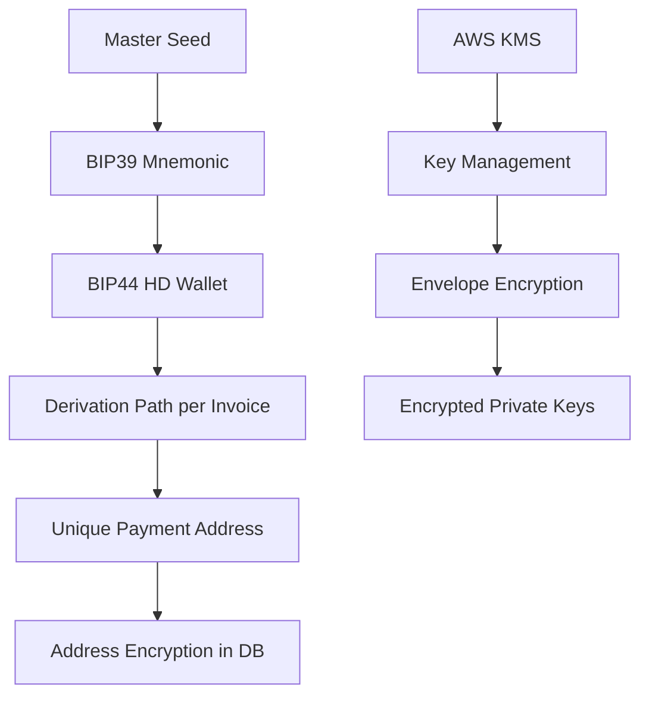
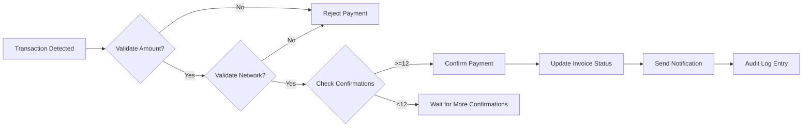

# План Безопасности Кошелька и Системы Платежей

## 🚨 Критические Уязвимости (Требуют Немедленного Исправления)

### 1. **Небезопасная Генерация Адресов**
**Текущая проблема:** Адреса генерируются детерминированно на основе invoiceId + мастер-ключ, что позволяет предсказать адреса.

**Решение:**
- Использовать HD-кошельки с BIP39/BIP44
- Каждый invoice получает уникальный derivation path
- Реализовать proper entropy для генерации

### 2. **Хранение Приватных Ключей в Открытом Виде**
**Текущая проблема:** Мастер-приватный ключ хранится в .env файле без шифрования.

**Решение:**
- AWS KMS, Google Cloud KMS или Azure Key Vault
- Hardware Security Modules (HSM)
- EnvKey или аналогичные инструменты для шифрования секретов

### 3. **Фальшивый Мониторинг Блокчейна**
**Текущая проблема:** BlockchainService симулирует платежи вместо реальной проверки.

**Решение:**
- Реальный мониторинг через Infura WebSocket
- Etherscan API для проверки транзакций
- Множественные RPC провайдеры для redundancy

### 4. **Отсутствие Валидации Платежей**
**Текущая проблема:** Нет проверки точной суммы, сети, токена.

**Решение:**
- Проверка суммы с допустимой погрешностью
- Валидация сети (mainnet/testnet)
- Поддержка ERC20 токенов с правильными контрактами

## 🛡️ Архитектурные Улучшения Безопасности

### **Криптографическая Безопасность**



### **Мониторинг и Аудит**



### **Защита от Атак**

1. **Rate Limiting:**
   - Ограничение создания инвойсов (10/час per IP)
   - Ограничение запросов к API (100/минута per IP)

2. **Input Validation:**
   - Строгая валидация всех входных данных
   - Защита от SQL injection через parameterized queries
   - Валидация Ethereum адресов через checksum

3. **Фронтенд Безопасность:**
   - CSP (Content Security Policy) headers
   - SRI (Subresource Integrity) для внешних скриптов
   - HTTPS only с HSTS

## 📋 Детальный План Реализации

### Фаза 1: Криптографическая Безопасность (Высокий Приоритет)
- [ ] Настроить HD-кошельки с BIP39
- [ ] Интегрировать Key Management Service
- [ ] Реализовать envelope encryption для ключей
- [ ] Обновить генерацию адресов

### Фаза 2: Мониторинг Блокчейна (Высокий Приоритет)
- [ ] Настроить реальный Infura WebSocket мониторинг
- [ ] Добавить Etherscan API fallback
- [ ] Реализовать multi-provider redundancy
- [ ] Добавить валидацию платежей по сумме/сети

### Фаза 3: Системная Безопасность (Средний Приоритет)
- [ ] Добавить rate limiting middleware
- [ ] Реализовать comprehensive input validation
- [ ] Настроить audit logging
- [ ] Добавить email/SMS уведомления

### Фаза 4: Продвинутые Фичи (Низкий Приоритет)
- [ ] Multi-signature кошельки
- [ ] Cold storage для крупных сумм
- [ ] Автоматический sweep мелких платежей
- [ ] Integration с custodian services

## 🔧 Технические Спецификации

### HD Wallet Структура
```
m/44'/60'/0'/0/0 (ETH mainnet)
├── Invoice 1: m/44'/60'/0'/0/1
├── Invoice 2: m/44'/60'/0'/0/2
└── Invoice N: m/44'/60'/0'/0/N
```

### Мониторинг Платежей
```typescript
interface PaymentValidation {
  txHash: string
  amount: BigNumber
  token: string // ETH, USDT, etc.
  network: string // mainnet, polygon, etc.
  confirmations: number
  timestamp: Date
  sender: string
  recipient: string
}
```

### Аудит Лог Структура
```sql
CREATE TABLE audit_events (
  id UUID PRIMARY KEY,
  event_type VARCHAR(50) NOT NULL,
  resource_type VARCHAR(50),
  resource_id VARCHAR(100),
  user_id UUID,
  ip_address INET,
  user_agent TEXT,
  old_values JSONB,
  new_values JSONB,
  timestamp TIMESTAMPTZ DEFAULT NOW()
);
```

## 🎯 Метрики Безопасности

### Доступность
- Uptime: 99.9% (SLA)
- Mean Time Between Failures (MTBF)
- Mean Time To Recovery (MTTR)

### Безопасность
- Количество обнаруженных уязвимостей
- Время обнаружения инцидентов
- Coverage security testing

### Производительность
- Transaction processing time: <5 секунд
- API response time: <200ms
- Blockchain sync delay: <30 секунд

## 📚 Рекомендуемые Инструменты

### Security Tools
- **Key Management:** AWS KMS, HashiCorp Vault
- **Monitoring:** Datadog, New Relic
- **Scanning:** Snyk, SonarQube
- **Testing:** Gauntlt, BDD Security

### Blockchain Tools
- **RPC Providers:** Infura, Alchemy, QuickNode
- **Monitoring:** Tenderly, Blocknative
- **Oracles:** Chainlink (for price feeds)

### Infrastructure
- **Cloud:** AWS/GCP/Azure with proper IAM
- **Database:** PostgreSQL with encryption at rest
- **Cache:** Redis with encryption
- **Load Balancer:** AWS ALB/NLB with WAF

---

## 🚀 Следующие Шаги

1. **Немедленно:** Начать с фазы 1 (криптографическая безопасность)
2. **В течение недели:** Реализовать HD-кошельки и KMS
3. **В течение месяца:** Полностью интегрировать мониторинг блокчейна
4. **Постоянно:** Мониторить, тестировать и улучшать безопасность

**Приоритет:** Безопасность превыше удобства. Лучше потерять пользователя, чем средства.